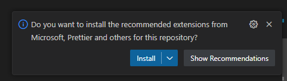
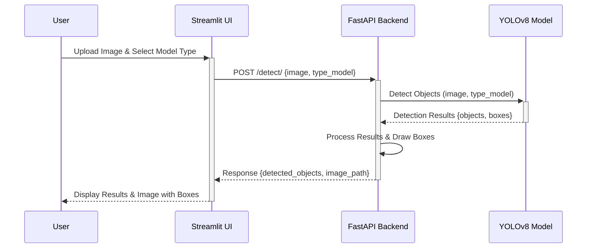

# BlurAnything

BlurAnything is an api and web application designed to offer users a powerful tool for blurring objects within images.
It leverages YOLO (You Only Look Once) version 8 for state-of-the-art object detection and utilizes a Streamlit interface for ease of use, combined with a FastAPI backend for robust and scalable image processing. This application is perfect for protecting sensitive information in images without sacrificing user friendliness.

## Project Structure

```text
BlurAnything/
│
├── backend/                    # FastAPI backend
│   ├── __init__.py
│   ├── app.py                  # FastAPI main application
│   ├── detect.py               # Object detection logic using YOLOv8
│   └── utls.py                 # Utils
│
├── frontend/                   # Streamlit frontend
│   ├── __init__.py
│   └── streamlit_app.py        # Streamlit application file for frontend
│
├── models/                     # Directory for storing YOLOv8 models and weights
│   └── (model files)           # YOLOv8 model files (not tracked in version control)
│
├── static/                     # Static files directory
│   └── images/                 # Directory to store images (e.g., uploaded images, processed results)
│
├── tests/
│   ├── __init__.py
│   ├── test_streamlit_app.py   # Tests for Streamlit application
│   ├── test_app.py             # Tests for FastAPI endpoints
│   └── test_detect.py          # Tests for object detection logic
│
├── __init__.py
├── LICENSE
├── pytest.ini                  # Configuration file for pytest
├── README.md                   # Project overview, setup instructions, and usage guide
└── requirements.txt            # Python dependencies
```

## Features

- __Object Detection__: Utilizes YOLOv8 for accurate object detection in images.
- __Image Blurring__: Offers precise blurring options to obscure detected objects, ensuring the protection of sensitive data or privacy in images.
- __Streamlit Interface__: Provides a straightforward and interactive Streamlit interface for uploading images and viewing results.
- __Customization Options__: Allows users to select specific objects for blurring, adjust the blurring intensity.

## Installation

To set up BlurAnything on your local machine, follow these steps:

1. Create a new virtual environnment:

    ```bash
    python -m venv venv
    source venv/Scripts/activate  # On Windows
    source venv/bin/activate      # On Unix or MacOS

    ```

2. Install the required dependencies:

    ```bash
    pip install -r requirements.txt
    ```

3. Download the YOLOv8 model weights in models folder.

    ```text
    cd models
    curl -L -o models/yolov8n.pt https://github.com/ultralytics/assets/releases/download/v8.1.0/yolov8n.pt
    curl -L -o models/yolov8x.pt https://github.com/ultralytics/assets/releases/download/v8.1.0/yolov8x.pt
    ```

## Usage

To start the BlurAnything application, run the following command:

1. Activate virtual environment

    ```bash
    source venv/Scripts/activate  # On Windows
    source venv/bin/activate      # On Unix or MacOS
    ```

2. Run API backend

    ```shell
    uvicorn backend.app:app --reload
    ```

3. Run streamlit web app

    ```shell
    streamlit run frontend/streamlit_app.py
    ```

Navigate to the provided URLs in your web browser to access the Streamlit interface (<http://localhost:8501>) and interact with the FastAPI backend (<http://127.0.0.1:8000>).

- __Note:__ You can also use an experimental script to run both the backend and the front end with:

    ```bash
    .\run.ps1
    ```

## Working environment

Highly recommend to use Microsoft VS Code. You will find a folder ".vscode" with the settings and the extensions I'm using.
After cloning, you will have a pop-up "Do you want to install the recommended extensions from Microsoft, Prettier and others for this repository?": click on install.



## Technical documentation


