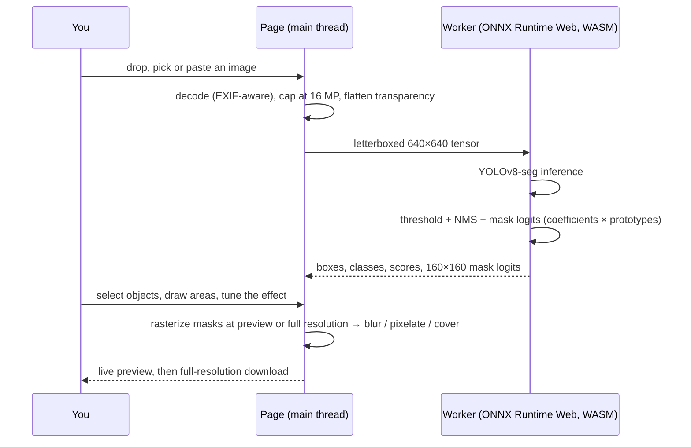

# BlurAnything

**Detect and blur anything in your photos — 100% in your browser. Nothing is uploaded.**

[](https://github.com/mvmser/BlurAnything/actions/workflows/ci.yml)


Sharing a photo often means hiding a bystander, a screen, a license plate or a name tag. Most online tools make you
upload the picture to a server first. BlurAnything runs the AI model **on your device** (YOLOv8 instance segmentation
compiled to WebAssembly), so the image never leaves your browser tab.

## Features

- **Detects 80 kinds of objects** — people, vehicles, animals, phones, laptops, screens, bags… — with YOLOv8-seg.
- **Pixel-accurate masks** — the blur follows the outline of each object instead of a crude rectangle.
- **You decide what to hide** — click objects on the photo, tick them in the list, or select a whole class at once.
- **Blur anything else** — draw rectangles or ellipses for faces, plates, text, screens… anything the model doesn't know.
- **Blur, pixelate or cover**, with strength and edge-margin sliders and a hold-to-compare button.
- **Two models** — _Fast_ (YOLOv8n, 7 MB) and _Accurate_ (YOLOv8s, 24 MB); downloaded once, then cached.
- **Full-resolution export** (JPEG stays JPEG, everything else PNG) with all EXIF/GPS metadata stripped.
- **Works offline** — installable PWA, English and French, dark mode, keyboard and screen-reader friendly.

## Privacy by design

- **No backend at all.** The site is static files; there is no server that could receive your image.
- **The browser enforces it.** A strict Content-Security-Policy (`connect-src 'self'`) stops the page from contacting any
  other origin. No analytics, no cookies, no CDN, no web fonts.
- **It is tested.** An end-to-end test runs a whole session (open, detect, blur, export) and asserts that every request
  — including those of the inference worker and the service worker — goes to the same origin and that none sends data.
- **Metadata is dropped.** Exports are re-encoded from a canvas, so EXIF (GPS, camera, timestamps) is not carried over.

> **Tip:** a light Gaussian blur can sometimes be partly reversed. For sensitive information use **Pixelate** with a
> high strength, or **Cover**.

## How it works


```mermaid
sequenceDiagram
    participant U as You
    participant P as Page (main thread)
    participant W as Worker (ONNX Runtime Web, WASM)

    U->>P: drop, pick or paste an image
    P->>P: decode (EXIF-aware), cap at 16 MP, flatten transparency
    P->>W: letterboxed 640×640 tensor
    W->>W: YOLOv8-seg inference
    W->>W: threshold + NMS + mask logits (coefficients × prototypes)
    W-->>P: boxes, classes, scores, 160×160 mask logits
    U->>P: select objects, draw areas, tune the effect
    P->>P: rasterize masks at preview or full resolution → blur / pixelate / cover
    P-->>U: live preview, then full-resolution download
```

Details worth knowing:

- Inference runs in a **Web Worker**, so the interface never freezes. WebAssembly runs single-threaded because static
  hosts cannot send the COOP/COEP headers that multi-threading requires.
- Masks are kept as the model's 160×160 logits and **bilinearly resampled to any resolution**, so the preview (≤ 1600 px)
  and the full-resolution export are the same shape.
- Effect strength is relative to each object's size, so a face and a bus get a comparable result.
- Model weights are stored as **float16 and cast to float32 at load time**: half the download, same accuracy
  (boxes move by < 0.1 px, scores by ≈ 0.01 — measured against the float32 export).
- Measured on a shared cloud VM (single-threaded WASM): ≈ 0.8 s per image with _Fast_, ≈ 1.7 s with _Accurate_.

## Run it locally

No build step — the app is plain ES modules.

```bash
npm install     # dev tooling only (tests, formatting)
npm start       # http://127.0.0.1:4173
```

Any static file server works if it serves `.wasm` as `application/wasm`; the one in `scripts/serve.mjs` also supports
`--base /BlurAnything/` to try hosting under a sub-path (handy if your portfolio serves the app from a folder).

## Tests

```bash
npm test                               # 50 unit tests (Node's built-in runner)
npx playwright install chromium        # once
npm run test:e2e                       # real Chromium, real models, real inference
```

The end-to-end suite checks, among other things: detections match the Ultralytics + ONNX Runtime reference on the
sample image, selecting an object changes exactly the right pixels, the three effects, drawing and removing areas, the
export (size, format, no metadata), offline use after the first visit, hosting under a sub-path, zero third-party
requests, and an automated accessibility audit (axe-core, WCAG 2.1 A/AA, both themes, keyboard flow).

## Deploy

The whole site is the **`web/`** folder: static files, no build step.

**Netlify (recommended)** — _Add new site → Import an existing project_, pick this repository, leave the build command
empty (the publish directory `web` comes from `netlify.toml`) and deploy. Every pull request then gets its own preview
URL. Works with a private repository too. No repository at hand? Drag the `web/` folder onto
<https://app.netlify.com/drop>.

**Vercel · Cloudflare Pages** — same idea: no build command, output directory `web` (`vercel.json` is included).

**Any other static host** — upload the contents of `web/`.

Security and cache headers live in `web/_headers` (Netlify, Cloudflare Pages) and `vercel.json`. The same
Content-Security-Policy is also embedded in `index.html`, so the privacy guarantee does not depend on server
configuration. After deploying, set `og:url` / `og:image` in `web/index.html` to absolute URLs if you want rich link
previews.

## Models

| Model               | Size    | Speed | Use                       |
| ------------------- | ------- | ----- | ------------------------- |
| `yolov8n-seg.onnx`  | 7.0 MB  | ★★★   | default, mobile-friendly  |
| `yolov8s-seg.onnx`  | 23.8 MB | ★★    | more accurate, small items |

Re-export them (or try another YOLOv8-seg size) with the official Ultralytics weights:

```bash
python -m venv .venv && source .venv/bin/activate
pip install -r scripts/requirements.txt
python scripts/export_models.py --fp16-weights
```

Then update `bytes` and `sha256` in `web/js/config.js` — a unit test tells you if you forget. The class list is COCO-80;
a model trained on other classes needs its own names in `config.js` / `i18n.js`.

## Project structure

```text
BlurAnything/
├── web/                         the whole app — publish this folder
│   ├── index.html · css/app.css
│   ├── js/
│   │   ├── main.js              UI and state
│   │   ├── detector.js          worker API + image → tensor
│   │   ├── detector.worker.js   ONNX Runtime Web session (off the UI thread)
│   │   ├── postprocess.js       letterbox, NMS, mask decoding        (pure, unit-tested)
│   │   ├── masks.js             mask rasterization at any resolution (pure, unit-tested)
│   │   ├── effects.js           blur / pixelate / cover compositing  (pure, unit-tested)
│   │   └── image.js · i18n.js · config.js · theme-init.js
│   ├── models/                  YOLOv8 ONNX files
│   ├── vendor/ort/              ONNX Runtime Web (WASM)
│   └── samples/ · icons/ · sw.js · manifest.webmanifest · _headers
├── scripts/                     export_models.py · vendor-ort.mjs · serve.mjs · make-icons.mjs · make-screenshots.mjs
├── tests/                       unit/ · e2e/ · fixtures/
├── .github/workflows/           ci.yml
└── netlify.toml · vercel.json · playwright.config.js · package.json
```

The first version of this project (FastAPI + Streamlit + a server-side YOLOv8) is still in the git history, up to
commit `1aa351f`.

## Limitations

- Detects the **80 COCO classes** only. There is no face or license-plate detector — use the rectangle/ellipse tools.
- Very large photos are capped at 16 megapixels (browser canvas limits, notably on iOS).
- WebAssembly inference is CPU-only and single-threaded; a WebGPU backend would make _Accurate_ much faster.

## License and credits

See [LICENSE](LICENSE). Third-party components and models carry their own licenses — see
[THIRD_PARTY_NOTICES.md](THIRD_PARTY_NOTICES.md). Built with [YOLOv8](https://github.com/ultralytics/ultralytics) and
[ONNX Runtime Web](https://onnxruntime.ai/).

## En bref (FR)

BlurAnything détecte et floute n'importe quoi dans vos photos, **entièrement dans le navigateur** : aucune image n'est
envoyée. Le modèle YOLOv8 de segmentation tourne en WebAssembly ; vous cliquez les objets à masquer (ou dessinez vos
zones), choisissez flou, pixelisation ou masque plein, puis exportez en pleine résolution sans métadonnées.
L'interface est en français et en anglais, fonctionne hors ligne et se déploie en copiant le dossier `web/` sur
n'importe quel hébergeur statique (Netlify, Vercel, Cloudflare Pages…).
