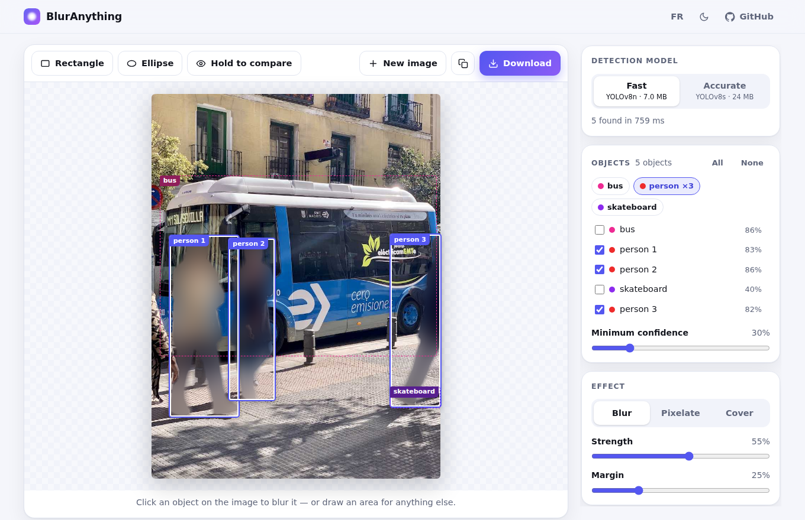
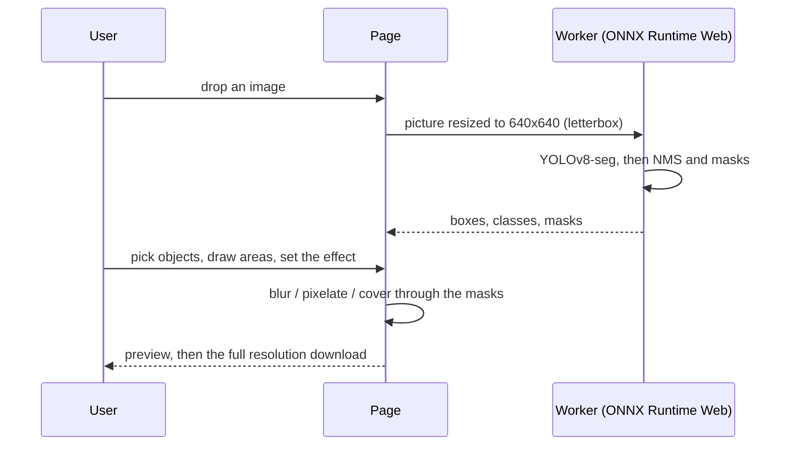

# BlurAnything

Detects the objects in a photo and blurs the ones you pick. It all runs in the browser: the YOLOv8 model is executed with
ONNX Runtime Web (WebAssembly), so the image never leaves your device.

**Demo: <https://mvmser.github.io/BlurAnything/>**



## What it does

- Finds 80 kinds of objects (people, cars, animals, screens...) with YOLOv8 segmentation, so the blur follows the
  outline of the object instead of a rectangle.
- Click an object on the photo or in the list to blur it, or a whole class at once.
- Draw a rectangle or an ellipse for what the model doesn't know (faces, plates, text).
- Blur, pixelate or cover, with strength and margin sliders.
- Two models: fast (7 MB) and accurate (24 MB).
- Saves the result at full resolution, without EXIF/GPS data.
- Works offline after the first visit. English and French.

## How it works


```mermaid
sequenceDiagram
    participant U as User
    participant P as Page
    participant W as Worker (ONNX Runtime Web)

    U->>P: drop an image
    P->>W: picture resized to 640x640 (letterbox)
    W->>W: YOLOv8-seg, then NMS and masks
    W-->>P: boxes, classes, masks
    U->>P: pick objects, draw areas, set the effect
    P->>P: blur / pixelate / cover through the masks
    P-->>U: preview, then the full resolution download
```

The model runs in a Web Worker so the page stays responsive. The masks are the model's 160x160 outputs, resampled to
whatever size is needed, so the preview and the full resolution export have the same shape.

Nothing is sent anywhere: the page has a Content-Security-Policy that only allows its own origin, and one of the tests
checks that a whole session makes no request to another site.

A light blur can sometimes be partly undone, so for sensitive stuff use pixelate with a high strength, or cover.

## Run it

No build step, it's plain ES modules.

```bash
npm install
npm start        # http://127.0.0.1:4173
```

## Tests

```bash
npm test                          # unit tests (node)
npx playwright install chromium   # once
npm run test:e2e                  # real browser, real models
```

The end-to-end tests check that the detections match the Ultralytics reference on the sample photo, that selecting an
object blurs the right pixels, drawing, export, offline mode, hosting under a sub-path and accessibility (axe).

## Models

`web/models/` has YOLOv8n-seg and YOLOv8s-seg converted to ONNX. To redo it:

```bash
pip install -r scripts/requirements.txt
python scripts/export_models.py --fp16-weights
```

Then update `bytes` and `sha256` in `web/js/config.js` (a unit test fails if you forget). The weights are stored as
float16 and converted back to float32 when the model starts, which halves the download without changing the results.

## Deploy

The site is the `web/` folder, plain static files. The workflow in `.github/workflows/ci.yml` runs the tests and
publishes it to GitHub Pages when `develop` is pushed (Settings > Pages > Source: GitHub Actions). Any other static host
works too: just serve `web/`.

## Limits

- Only the 80 COCO classes: no faces or plates, hence the drawing tools.
- Pictures over 16 megapixels are scaled down (canvas limits, iOS especially).
- The model runs on the CPU with one thread, WebGPU would be faster.

## Credits

[YOLOv8](https://github.com/ultralytics/ultralytics) by Ultralytics and
[ONNX Runtime Web](https://onnxruntime.ai/). Licenses of the model, runtime and sample photos are in
[THIRD_PARTY_NOTICES.md](THIRD_PARTY_NOTICES.md).

The first version of this project (FastAPI backend and Streamlit frontend) is in the git history, up to commit `1aa351f`.
